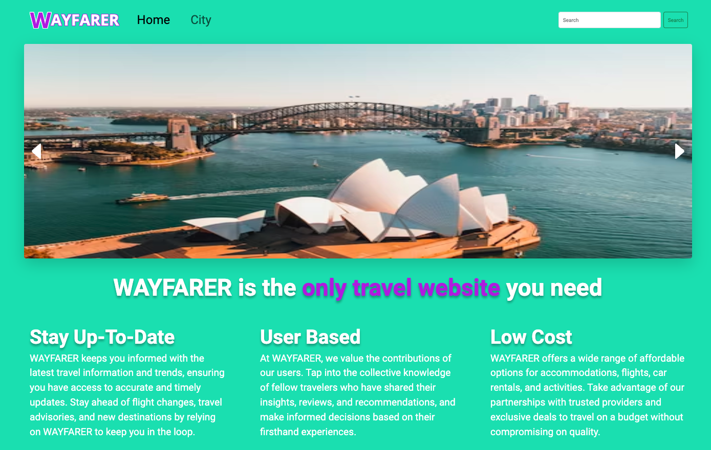
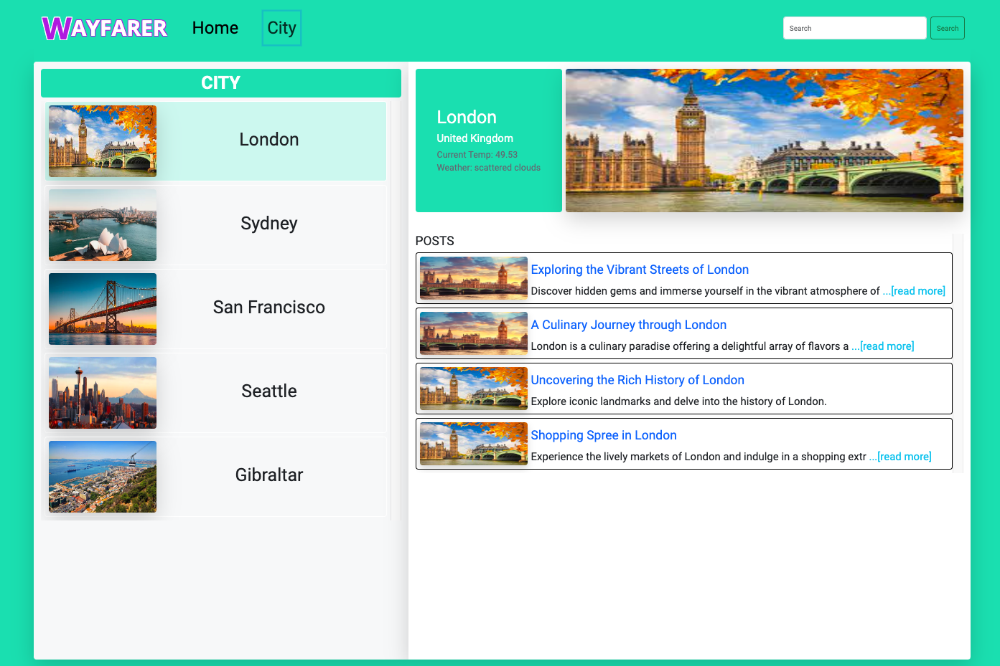
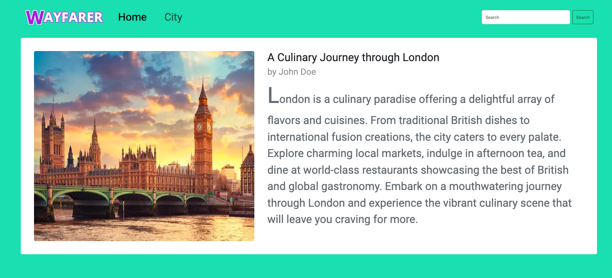

# Wayfarer

This project was generated with [Angular CLI](https://github.com/angular/angular-cli) version 16.0.2. A travel community for users to share city-specific tips ("posts" or "logs") about their favorite locations around the world.

# Technologies used

- 
- 
- 
- 
- 
- 

# User Stories

Sprint 1: Landing Page
A user should be able to:

1. Navigate to "/" and see a basic splash page with the name of the website.
2. See the site-wide header on every page with a link to home page with list of cities.

Sprint 2: HomePage
A user should be able to:

1. View the "San Francisco" page (at "/cities/1") including:
   - The site-wide header.
   - The name of the city.
   - An iconic photo of the city.
2. View a list of posts on the San Francisco page:
   - Sorted by newest first.
   - With the post titles linked to the individual post "show" pages.
3. Use the search bar to search through the posts' title and/or content.
4. Click on the title of one of their posts and be redirected to a "show" page for that post.
5. View post "show" pages with title, author, and content.

Sprint 3: Validations
A user should be able to:

1. View city pages for "London" and "Gibraltar".
2. A post's title must be between 1 and 200 characters.
3. A post's content must not be empty.

Sprint 4: Weather API

1. Call Open Weather API for each city to display the current weather on each city's page.

# Wireframes

# Application Screenshots

# Group Collaboration

1. How did your group approach the requirements? (mention anything unique or creative your group chose to do)
   - My group stayed with the pair programming or all three of us were working together. Jeff showed us a lot of different ways how to code and customize or travel app. We used Figma which was excellent. We will defintely use this in the future.
2. What was easier than you thought? What was more challenging?
   - All of our answers are different. For Jeff it was the logical part, search bar, and the navigation. Velvet, creating the paths to the pages. For example the routerlinks. For me nothing was easy but I learned a lot. The more challeging area was customizing the app. Getting the app exactly how we wanted it. Also, sprint 4. The weather api was harder than expected.
3. What is a lesson you will carry forward to working on your next project?
   - The lesson we will carry on to the next project is Pseudocode. Write down word for word what needs to be done. The Kanban board always is a great tool to keep the group on the same page. Communcation is key with working in a group project.

## How to run the application

    
Click to expand

## Development server

Run `ng serve` for a dev server. Navigate to `http://localhost:4200/`. The application will automatically reload if you change any of the source files.

## Code scaffolding

Run `ng generate component component-name` to generate a new component. You can also use `ng generate directive|pipe|service|class|guard|interface|enum|module`.

## Build

Run `ng build` to build the project. The build artifacts will be stored in the `dist/` directory.

## Running unit tests

Run `ng test` to execute the unit tests via [Karma](https://karma-runner.github.io).

## Running end-to-end tests

Run `ng e2e` to execute the end-to-end tests via a platform of your choice. To use this command, you need to first add a package that implements end-to-end testing capabilities.

## Further help

To get more help on the Angular CLI use `ng help` or go check out the [Angular CLI Overview and Command Reference](https://angular.io/cli) page.

# Credits

Thank you to the team for completing an amazing project. Thank you to our classmates for always sharing knowledge and making us laugh when we all are online at 10pm sometimes 11pm EST getting our work done.

# Resources

- RouterLink: https://angular.io/api/router/RouterLink

- Bootstrap: https://getbootstrap.com/docs/5.3/customize/sass/

- Unsplash: www.unsplash.com

- [CSS ::first-letter Selector](https://www.w3schools.com/cssref/sel_firstletter.php#:~:text=The%20%3A%3Afirst%2Dletter%20selector,color%20properties)

- [developer.mozilla.org](https://developer.mozilla.org/en-US/docs/Web/CSS/Using_CSS_custom_properties)

- Medium: The 60–30–10 Rule: A Foolproof Way to Choose Colors for Your UI Design
